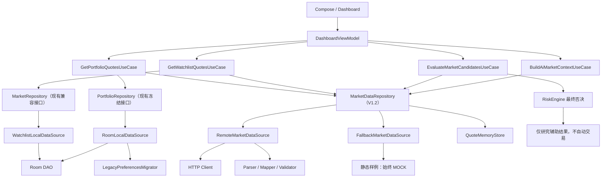
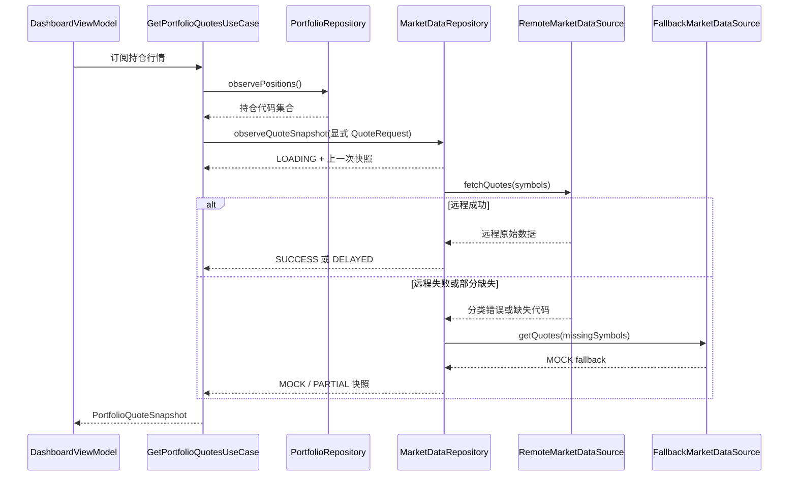

# GD Trade V1.2 行情系统架构方案

## 1. 文档状态

- 版本：V1.2 架构草案 1.0。
- 日期：2026-07-14。
- 负责角色：GD Architect Agent。
- 状态：待架构评审与接口冻结。
- 实施边界：本方案只定义架构、接口和迁移顺序，不接入新行情 API，不修改 Kotlin 业务代码、Room、UI 或交易逻辑。
- 前置约束：V1.1 自动化验收已通过，但真实设备旧版覆盖升级仍是独立发布门禁；V1.2 可以并行开发，不得破坏 V1.1 验收现场。

## 2. 当前问题

### 2.1 RoomTradeRepository 职责过多

当前 `RoomTradeRepository` 同时承担：

- 获取 Room Database、DAO 并读写持仓和交易记录。
- 触发 SharedPreferences 到 Room 的旧数据迁移。
- 读写本地观察池。
- 维护行情刷新触发器。
- 拼接远程行情请求参数并直接执行网络请求。
- 解析第三方响应文本。
- 判断网络错误并生成静态 fallback。
- 同时实现 `PortfolioRepository` 和 `MarketRepository`。

该实现已经成为本地数据、远程行情和业务组合的共享热点。继续加入 K 线、板块、资金流和评分逻辑会放大测试成本与 Agent 冲突概率。

### 2.2 当前行情契约语义不足

- `observeQuotes(emptyList())` 隐式表示“跟随当前持仓”，调用语义不直观。
- `MarketQuote` 只有价格、涨跌幅、来源文案和 `isRealtime`，无法表达加载、失败、延迟、Mock、更新时间、成交量、成交额和换手率。
- 网络失败直接替换为 fallback，调用方无法区分远程失败、部分成功和静态样例。
- 当前腾讯接口数据已经标注“可能延迟”，但缺少结构化时效性字段。
- 批量请求缺少缺失代码、部分解析失败和数据完整度描述。

### 2.3 DashboardViewModel 业务编排过重

当前 ViewModel 直接完成：

- 持仓、行情、观察池、交易记录四路 Flow 组合。
- 对每个候选执行 RiskEngine。
- 生成 ChatGPT 分析上下文和提示词。
- 解释空股票列表的隐含语义。

V1.2 再增加评分、详情和板块强弱后，ViewModel 会成为不可独立复用和难以测试的业务中心。

### 2.4 数据来源边界不够清晰

远程成功、延迟数据、解析失败和静态样例目前都最终表现为 `List<MarketQuote>`。这不利于：

- 股票评分判断数据质量。
- AI 输出准确的数据来源和时效说明。
- RiskEngine 在数据缺失或过期时采取保守策略。
- UI 展示刷新中、失败或部分数据状态。

## 3. 设计原则

1. **保持兼容**：V1.2 不删除、不重命名、不改变现有 `PortfolioRepository` 和 `MarketRepository` 方法语义。
2. **数据源单责**：Room 与旧数据迁移只存在于 LocalDataSource；HTTP、DTO 和解析只存在于 RemoteMarketDataSource。
3. **Repository 组合**：Repository 负责数据源协调、缓存策略、fallback 策略和领域模型映射，不负责 UI 文案或评分规则。
4. **显式请求**：新接口不再用空列表表达“当前持仓”，由 UseCase 明确解析持仓或观察池股票代码。
5. **来源可追溯**：每一条行情必须携带结构化来源、更新时间和状态。
6. **Mock 不冒充实时**：Mock、静态样例和 fallback 必须标记为 `MOCK`，不能仅靠文案区分。
7. **风险优先**：行情评分和 AI 只能生成研究输入；RiskEngine 始终拥有最终否决权。
8. **能力分段**：报价、K 线、板块和资金流使用独立能力接口，避免形成新的超大 MarketRepository。
9. **先测试后替换**：先建立当前行为特征测试，再抽取实现，最后迁移 ViewModel。
10. **本轮不改 Room**：V1.2 第一阶段行情快照使用内存状态，不新增 Entity 或数据库版本。

## 4. 新架构设计

### 4.1 逻辑结构

```text
UI / Compose
    |
DashboardViewModel / StockDetailViewModel
    |
Domain UseCase
    |-- GetPortfolioQuotesUseCase
    |-- GetWatchlistQuotesUseCase
    |-- GetStockDetailUseCase
    |-- GetMarketOverviewUseCase
    |-- EvaluateMarketCandidatesUseCase
    |
Repository Ports
    |-- PortfolioRepository             现有接口，冻结
    |-- MarketRepository                现有兼容接口，冻结
    |-- MarketDataRepository            V1.2 富行情端口
    |-- CandleRepository                未来能力端口
    |-- SectorMarketRepository          未来能力端口
    `-- CapitalFlowRepository           未来能力端口
    |
Default Repository Implementations
    |-- DefaultPortfolioRepository
    `-- DefaultMarketRepository
          |-- LocalDataSource
          |-- RemoteMarketDataSource
          |-- FallbackMarketDataSource
          `-- QuoteMemoryStore
    |
Data Sources
    |-- RoomLocalDataSource
    |     |-- PositionDao
    |     |-- TradeRecordDao
    |     |-- StockCandidateDao
    |     `-- LegacyPreferencesMigrator
    |-- ProviderRemoteMarketDataSource
    |     |-- Http Client
    |     |-- DTO
    |     |-- Parser
    |     `-- Mapper / Validator
    `-- StaticFallbackMarketDataSource
```

### 4.2 LocalDataSource

“LocalDataSource”是本地数据能力总称。为了避免再次形成大接口，按能力拆分：

```kotlin
interface PortfolioLocalDataSource {
    fun observePositions(): Flow<List<Position>>
    fun observeTradeRecords(): Flow<List<TradeRecord>>
    suspend fun upsertPosition(position: Position)
    suspend fun deletePosition(symbol: String)
    suspend fun insertTradeRecord(record: TradeRecord)
    suspend fun deleteTradeRecord(recordKey: String)
    suspend fun resetPortfolioData()
}

interface WatchlistLocalDataSource {
    fun observeCandidates(): Flow<List<StockCandidate>>
    suspend fun upsertCandidate(candidate: StockCandidate)
    suspend fun deleteCandidate(symbol: String)
    suspend fun resetCandidates()
}

interface LegacyMigrationCoordinator {
    suspend fun migrateIfNeeded()
}
```

`RoomLocalDataSource` 可以实现前两个能力接口，并在公开读取或写入前通过注入的 `LegacyMigrationCoordinator` 保证迁移完成。DAO、Entity 和 SharedPreferences 迁移实现不得泄露给 Repository 上层。

V1.2 不修改 Room Schema。`Position`、`TradeRecord`、`StockCandidate` 的表和映射继续沿用 V1.1。

### 4.3 RemoteMarketDataSource

RemoteMarketDataSource 只负责远程数据获取与解析，不访问 Room，不读取持仓，不决定 UI fallback：

```kotlin
interface RemoteMarketDataSource {
    suspend fun fetchQuotes(symbols: Set<String>): RemoteMarketResult<List<RemoteStockQuote>>
    suspend fun fetchStockDetail(symbol: String): RemoteMarketResult<RemoteStockDetail>
}
```

职责边界：

- HTTP 请求、超时和响应码处理。
- 供应商股票代码转换。
- DTO 或文本协议解析。
- 字段单位归一化前的原始结果。
- 返回可分类错误，不直接生成静态行情。

建议内部继续细分：

- `MarketHttpClient`：网络调用。
- `MarketResponseParser`：纯解析，无 Android 依赖。
- `RemoteMarketMapper`：DTO 到领域模型，负责单位和空值校验。
- `MarketProviderConfig`：供应商名称、时效声明、批量上限和超时。

当前已有腾讯行情逻辑可以在 Developer 阶段原样抽取为一个 provider 实现。由于现有数据被声明“可能延迟”，在没有可靠时效证明前必须映射为 `DELAYED`，不能映射为真实实时状态。

### 4.4 FallbackMarketDataSource

静态样例和网络失败 fallback 独立为：

```kotlin
interface FallbackMarketDataSource {
    suspend fun getQuotes(symbols: Set<String>): List<StockQuote>
}
```

强制规则：

- 返回的每条数据状态必须是 `MOCK`。
- 来源类型必须是 `STATIC_SAMPLE` 或 `FALLBACK`。
- `supportsRealtime` 必须为 `false`。
- 不得用最近一次静态价格替代成功远程数据且标记为 `SUCCESS`。
- 批次中远程数据和 Mock 数据混用时，每条记录保留自己的状态，批次完整度标记为 `PARTIAL`。

### 4.5 QuoteMemoryStore

V1.2 第一阶段只使用进程内行情快照：

- 按股票代码保存最后一次 `StockQuote`。
- 保存请求状态、缺失代码和最近刷新时间。
- 不写入 Room，不触发数据库迁移。
- 应用重启后重新获取；无网络时回退为明确的 `MOCK` 或 `ERROR`。

未来如需持久化历史行情，必须单独设计 Room version 2 Migration，不能在本次职责拆分中顺带加入。

## 5. 行情领域模型

### 5.1 数据状态

```kotlin
enum class MarketDataStatus {
    SUCCESS,
    LOADING,
    ERROR,
    DELAYED,
    MOCK
}
```

状态定义：

| 状态 | 定义 | 是否可声称实时 |
| --- | --- | --- |
| SUCCESS | 远程请求成功、字段校验通过且满足该数据源约定的新鲜度 | 不能仅凭 SUCCESS 声称实时，仍需数据源明确支持 |
| LOADING | 请求进行中，可携带上一次可用快照 | 否 |
| ERROR | 请求失败且没有满足要求的新数据，可附带上一次数据 | 否 |
| DELAYED | 供应商声明延迟，或更新时间超过新鲜度阈值 | 否 |
| MOCK | 静态、样例、模拟或 fallback 数据 | 否 |

状态优先级不能用于交易执行。评分和 AI 必须同时检查状态、更新时间、来源和完整度。

### 5.2 股票行情

```kotlin
data class StockQuote(
    val symbol: String,
    val name: String,
    val lastPrice: Double?,
    val changePercent: Double?,
    val volume: Long?,
    val turnoverAmount: Double?,
    val turnoverRate: Double?,
    val updatedAt: Instant?,
    val dataStatus: MarketDataStatus,
    val source: MarketSourceInfo
)
```

字段约束：

- `symbol`：统一使用六位 A 股或 ETF 代码，交易所前缀只存在于远程数据源内部。
- `lastPrice`：人民币元；不可解析时为 null，不能用 0 表示未知。
- `changePercent`、`turnoverRate`：百分比数值，例如 `1.25` 表示 1.25%。
- `volume`：归一化为股或份，供应商若返回“手”必须在 Mapper 中转换并记录规则。
- `turnoverAmount`：人民币元，供应商单位转换在 Mapper 完成。
- `updatedAt`：行情供应商时间；未知时为 null，不能使用手机当前时间伪装行情时间。
- `dataStatus`：每条行情独立状态，批量部分回退时不能只使用批次状态覆盖。
- `source`：结构化来源信息，UI 文案从该模型派生，不由 parser 拼接。

### 5.3 数据来源

```kotlin
data class MarketSourceInfo(
    val providerId: String,
    val displayName: String,
    val sourceType: MarketSourceType,
    val supportsRealtime: Boolean,
    val declaredDelaySeconds: Long?,
    val receivedAt: Instant
)

enum class MarketSourceType {
    REMOTE,
    LOCAL_CACHE,
    STATIC_SAMPLE,
    FALLBACK
}
```

约束：

- 当前静态数据：`sourceType=STATIC_SAMPLE`、`supportsRealtime=false`、`dataStatus=MOCK`。
- 当前腾讯接口：在时效能力未验证前 `supportsRealtime=false`、`dataStatus=DELAYED`。
- `supportsRealtime=true` 只有在供应商能力、授权和时间字段均明确时才允许设置。

### 5.4 批量快照和请求状态

```kotlin
data class QuoteSnapshot(
    val requestedSymbols: Set<String>,
    val quotes: Map<String, StockQuote>,
    val missingSymbols: Set<String>,
    val completeness: DataCompleteness,
    val generatedAt: Instant
)

enum class DataCompleteness {
    COMPLETE,
    PARTIAL,
    EMPTY
}

data class MarketDataState<T>(
    val status: MarketDataStatus,
    val data: T?,
    val error: MarketDataError? = null
)
```

批次状态汇总规则：

1. 请求中为 `LOADING`，可以携带上一次快照。
2. 全部远程数据满足新鲜度时为 `SUCCESS`。
3. 任一有效记录为延迟且没有 Mock 时为 `DELAYED`。
4. 任一请求代码使用 Mock fallback 时批次为 `MOCK`，每条记录状态仍保留。
5. 没有可用数据且请求失败时为 `ERROR`。
6. 使用 `completeness` 和 `missingSymbols` 表达部分成功，不伪造完整批次。

### 5.5 兼容 MarketQuote

现有 `MarketQuote` 在 V1.2 不删除。建立单向兼容 Mapper：

```text
StockQuote -> Legacy MarketQuote -> 当前 Dashboard
```

映射规则：

- `sourceLabel` 由 `MarketSourceInfo`、`updatedAt`、`dataStatus` 统一生成。
- `isRealtime` 只有 `dataStatus=SUCCESS` 且 `source.supportsRealtime=true` 时才为 true。
- `DELAYED`、`MOCK`、`ERROR`、`LOADING` 一律映射为 false。
- 不从旧 `MarketQuote` 反向推断完整的 StockQuote，避免制造成交量、时间和来源信息。

## 6. Repository 接口方案

### 6.1 冻结现有接口

当前 `PortfolioRepository` 和 `MarketRepository` 在 V1.2 第一阶段保持签名不变。尤其不改变：

- `observeQuotes(emptyList())` 的现有兼容行为。
- 观察池增删和重置方法。
- `refreshMarketQuotes()` 的调用入口。
- `MarketQuote` 返回类型。

不直接在现有 `MarketRepository` 增加抽象方法，因为这会同时破坏 `RoomTradeRepository`、`StaticMarketRepository`、Fake 实现和 ViewModel 测试。

### 6.2 新增 V1.2 富行情端口

建议新增独立接口 `MarketDataRepository`：

```kotlin
interface MarketDataRepository {
    fun observeQuoteSnapshot(
        request: QuoteRequest
    ): Flow<MarketDataState<QuoteSnapshot>>

    suspend fun refreshQuotes(
        request: QuoteRequest
    ): RefreshMarketResult

    suspend fun getStockDetail(
        symbol: String,
        policy: FetchPolicy = FetchPolicy.NETWORK_FIRST
    ): MarketDataState<StockDetail>
}

data class QuoteRequest(
    val symbols: Set<String>,
    val policy: FetchPolicy,
    val maxAge: Duration,
    val requestReason: QuoteRequestReason
)

enum class QuoteRequestReason {
    PORTFOLIO,
    WATCHLIST,
    STOCK_DETAIL,
    MARKET_OVERVIEW,
    AI_CONTEXT,
    SCORING
}

enum class FetchPolicy {
    CACHE_FIRST,
    NETWORK_FIRST,
    NETWORK_ONLY
}
```

接口规则：

- `symbols` 不允许通过空集合表达持仓或观察池；股票范围由 UseCase 解析。
- Repository 负责去重、批量分片、刷新取消和状态归并。
- `refreshQuotes` 返回结构化结果，不抛出供应商协议异常给 ViewModel。
- `getStockDetail` 返回详情快照，不直接返回远程 DTO。
- 当前兼容 `MarketRepository` 与新 `MarketDataRepository` 由同一个 `DefaultMarketRepository` 实现或通过适配器组合，避免两套网络请求逻辑。

### 6.3 当前持仓行情

不在 Repository 内部读取持仓。由 `GetPortfolioQuotesUseCase`：

1. 订阅 `PortfolioRepository.observePositions()`。
2. 提取、清洗和去重股票代码。
3. 构造 `QuoteRequest(reason=PORTFOLIO)`。
4. 调用 `MarketDataRepository.observeQuoteSnapshot()`。
5. 将持仓与行情按代码组合为领域输出。

这样消除 `observeQuotes(emptyList())` 的隐式语义，同时保留旧接口给当前 Dashboard。

### 6.4 股票详情行情

`GetStockDetailUseCase` 通过 `MarketDataRepository.getStockDetail()` 获取：

- 当前报价。
- 数据状态和来源。
- 可选基础行情字段。
- 后续由独立 CandleRepository 补充 K 线。

详情请求必须校验股票代码，错误映射为领域错误，不让 ViewModel 解析异常消息。

### 6.5 批量观察池行情

`GetWatchlistQuotesUseCase`：

1. 订阅 `MarketRepository.observeCandidates()` 或后续独立 WatchlistRepository。
2. 生成显式 symbol 集合。
3. 调用富行情端口批量查询。
4. 保留 `missingSymbols`、每条数据状态和观察池显示顺序。

### 6.6 未来能力端口

未来能力不得继续堆入 MarketDataRepository，按能力新增：

```kotlin
interface CandleRepository {
    fun observeCandles(request: CandleRequest): Flow<MarketDataState<CandleSeries>>
}

interface SectorMarketRepository {
    fun observeSectorOverview(request: SectorRequest): Flow<MarketDataState<SectorOverview>>
}

interface CapitalFlowRepository {
    fun observeCapitalFlow(request: CapitalFlowRequest): Flow<MarketDataState<CapitalFlowSnapshot>>
}
```

建议领域模型：

- `Candle`：时间、开高低收、成交量、成交额、复权类型、状态与来源。
- `SectorQuote`：板块代码、名称、涨跌幅、成交额、上涨家数、下跌家数、更新时间与来源。
- `SectorStrength`：标准化强度分、样本覆盖率、计算时间和输入数据质量。
- `CapitalFlowSnapshot`：主力净流入等供应商字段、口径说明、更新时间和来源。

没有可验证数据源时返回 `ERROR` 或不提供能力，禁止用 Mock 板块强弱生成真实投资结论。

## 7. UseCase 层设计

### 7.1 GetPortfolioQuotesUseCase

输入：持仓 Flow、刷新策略。

输出：

```kotlin
data class PortfolioQuoteSnapshot(
    val items: List<PositionWithQuote>,
    val marketState: MarketDataStatus,
    val missingSymbols: Set<String>,
    val updatedAt: Instant?
)
```

职责：

- 解析持仓代码。
- 请求批量行情。
- 按持仓顺序组合。
- 保留缺失、延迟和 Mock 状态。
- 不执行评分、不生成买卖指令。

### 7.2 GetWatchlistQuotesUseCase

职责：观察池与行情组合、保留显示顺序和风险字段，为后续评分提供输入。

### 7.3 GetStockDetailUseCase

职责：代码校验、详情行情加载、数据状态统一、后续组合 K 线。ViewModel 只处理加载与用户事件。

### 7.4 GetMarketOverviewUseCase

职责：组合指数、板块宽度和板块强弱能力。第一阶段若没有板块数据源，必须输出“不可用”，不得根据少量观察池伪造全市场概览。

### 7.5 EvaluateMarketCandidatesUseCase

建议流水线：

```text
行情快照
  -> 数据质量校验
  -> 股票评分（研究分，不是买入信号）
  -> 候选规则
  -> RiskEngine 最终否决
  -> 研究型候选输出
```

强制规则：

- `MOCK`、严重延迟、字段缺失时降低置信度或拒绝评分。
- 股票评分不能覆盖 `riskDeniedBuy=true`。
- RiskEngine 的否决结果不能被 AI、分数或 UI 操作反转。

### 7.6 BuildAiMarketContextUseCase

将当前 ViewModel 内提示词数据准备迁出：

- 输入持仓行情、观察池、交易记录、评分和风险结论。
- 每条行情包含状态、来源和更新时间。
- Mock 或延迟数据必须在 AI 上下文中明确标识。
- 输出结构化 `AiMarketContext`；自然语言提示词由独立 Formatter 生成。
- AI 只生成研究意见，不生成可执行订单。

### 7.7 DashboardViewModel 目标职责

迁移完成后的 ViewModel 仅负责：

- 订阅 UseCase 输出并转换为 DashboardUiState。
- 处理刷新、增删本地记录等用户事件。
- 管理短生命周期 UI 状态。

ViewModel 不再：

- 理解空 symbol 列表语义。
- 直接组合四路数据源。
- 逐条调用 RiskEngine。
- 构建完整 AI 提示词。
- 判断 fallback 或行情新鲜度。

## 8. 数据流图



### 8.1 刷新时序



## 9. 文件所有权

### 9.1 GD Architect Agent

主要所有权：

- `docs/V1_2_MARKET_ARCHITECTURE_PLAN.md`
- `docs/ARCHITECTURE.md` 的接口与数据流更新
- `docs/TASK_QUEUE.md` 的阶段和 Agent 分配
- Repository 和领域模型契约评审
- `CHANGELOG.md` 架构变更条目审查
- 共享热点合并顺序协调

限制：不直接完成大规模 Kotlin 实现。

### 9.2 GD Developer Agent

按子任务独立分支和目录所有权拆分：

- Data-Local Developer：`data/local/datasource/**`、本地 Repository 委托实现。
- Data-Remote Developer：`data/remote/market/**`、DTO、Parser、Mapper、Provider 配置。
- Repository Developer：`data/repository/DefaultMarketRepository.kt`、兼容 Adapter、QuoteMemoryStore。
- Domain Developer：`domain/model/market/**`、`domain/repository/MarketDataRepository.kt`、`domain/usecase/market/**`。
- Integration Developer：应用容器和最后的 Dashboard UseCase 接入。

共享热点限制：

- `MarketRepository.kt`、`PortfolioRepository.kt` 在 V1.2 默认冻结，未经 Architect 批准不得修改。
- `RoomTradeRepository.kt` 同一时间只允许一个迁移任务修改。
- `DashboardViewModel.kt` 只在数据源与 UseCase 测试通过后由 Integration Developer 修改。
- `GdTradeDatabase.kt`、Entity、DAO、Schema 本轮禁止修改。

### 9.3 GD QA Agent

主要所有权：

- `app/src/test/**/data/remote/market/**`
- `app/src/test/**/data/repository/**`
- `app/src/test/**/domain/usecase/market/**`
- `app/src/test/**/ui/dashboard/**`
- `app/src/androidTest/**` 中经批准的集成测试
- `docs/qa/V1_2_MARKET_TEST_PLAN.md`
- V1.2 验收矩阵和回归报告

限制：未经确认不重构生产架构，不通过删除状态断言或放宽 Mock 标识让测试通过。

### 9.4 共享文件协调

以下文件只能串行修改：

- `TASK_COMPLETION.md`
- `CHANGELOG.md`
- `docs/ARCHITECTURE.md`
- Repository 公共接口
- DashboardViewModel
- Gradle 依赖文件

推荐合并顺序：架构文档与接口测试 -> Domain 模型与端口 -> DataSource -> Repository 组合 -> UseCase -> ViewModel 接入 -> QA 验收。

## 10. 预期文件修改范围

以下是 Developer 阶段建议范围，不代表本次已经创建：

```text
app/src/main/java/com/gudian/gdtrade/
├── domain/
│   ├── model/market/
│   │   ├── StockQuote.kt
│   │   ├── MarketDataStatus.kt
│   │   ├── MarketDataState.kt
│   │   ├── MarketSourceInfo.kt
│   │   ├── QuoteRequest.kt
│   │   └── QuoteSnapshot.kt
│   ├── repository/
│   │   ├── MarketDataRepository.kt
│   │   ├── CandleRepository.kt               未来
│   │   ├── SectorMarketRepository.kt          未来
│   │   └── CapitalFlowRepository.kt           未来
│   └── usecase/market/
│       ├── GetPortfolioQuotesUseCase.kt
│       ├── GetWatchlistQuotesUseCase.kt
│       ├── GetStockDetailUseCase.kt
│       ├── GetMarketOverviewUseCase.kt
│       ├── EvaluateMarketCandidatesUseCase.kt
│       └── BuildAiMarketContextUseCase.kt
├── data/
│   ├── local/datasource/
│   │   ├── PortfolioLocalDataSource.kt
│   │   ├── WatchlistLocalDataSource.kt
│   │   └── RoomLocalDataSource.kt
│   ├── remote/market/
│   │   ├── RemoteMarketDataSource.kt
│   │   ├── ProviderRemoteMarketDataSource.kt
│   │   ├── MarketHttpClient.kt
│   │   ├── MarketResponseParser.kt
│   │   ├── RemoteMarketMapper.kt
│   │   └── dto/
│   ├── cache/
│   │   └── QuoteMemoryStore.kt
│   └── repository/
│       ├── DefaultPortfolioRepository.kt
│       ├── DefaultMarketRepository.kt
│       ├── LegacyMarketRepositoryAdapter.kt
│       └── StaticFallbackMarketDataSource.kt
└── ui/dashboard/
    └── DashboardViewModel.kt                  最后迁移
```

兼容保留：

- `domain/model/MarketQuote.kt`
- `data/repository/MarketRepository.kt`
- `data/repository/PortfolioRepository.kt`
- `data/repository/LocalPreferenceRepository.kt`
- `data/repository/StaticMarketRepository.kt`

## 11. 分阶段迁移方案

### 阶段 0：冻结与特征测试

- 冻结现有 Repository 接口。
- 保留现有 RepositoryRegressionTest 和 DashboardViewModelTest。
- 增加当前远程解析、fallback 和空 symbol 行为的特征测试。
- 不改变生产行为。

退出条件：当前行为可由测试复现，V1.1 测试继续通过。

### 阶段 1：抽取 LocalDataSource

- 把 DAO 调用和旧数据迁移触发移入 RoomLocalDataSource。
- RoomTradeRepository 改为委托，不改变公开接口和结果顺序。
- 不修改 Entity、DAO、Database version 和 Schema。

退出条件：Room、Repository 和 V1.1 迁移测试全部通过。

### 阶段 2：抽取 RemoteMarketDataSource

- 将 HTTP、股票代码转换和响应解析移出 RoomTradeRepository。
- 建立 parser fixture 测试。
- 将静态 fallback 独立为 FallbackMarketDataSource。
- 保持旧 `MarketQuote` 输出一致，并继续标记非实时。

退出条件：远程成功、超时、HTTP 错误、格式错误、部分缺失和 fallback 测试通过。

### 阶段 3：引入 V1.2 领域模型与富行情端口

- 新增 StockQuote、状态、来源、请求和快照模型。
- 新增 MarketDataRepository。
- DefaultMarketRepository 同时支持新端口和现有兼容接口。
- 增加 StockQuote 到 MarketQuote 单向 Adapter。

退出条件：现有 Dashboard 不修改仍可工作，新端口测试独立通过。

### 阶段 4：引入 UseCase

- 实现持仓、观察池和详情 UseCase。
- 将风险评估放入 EvaluateMarketCandidatesUseCase。
- 将 AI 上下文构建放入 BuildAiMarketContextUseCase。
- 首先使用 Fake Repository 测试，不修改 UI。

退出条件：状态组合、取消、错误、Mock、延迟和风险否决测试通过。

### 阶段 5：迁移 Dashboard

- 通过轻量 ApplicationContainer 注入 Repository 和 UseCase。
- DashboardViewModel 改为消费 UseCase 输出。
- DashboardUiState 保持兼容，UI 第一轮不改布局。
- 保留旧 Repository Adapter，便于回滚。

退出条件：Dashboard 回归测试、Debug/Release 测试和 Debug APK 构建通过。

### 阶段 6：股票评分与未来能力

- 在行情状态和来源规则稳定后实现股票评分。
- K 线、板块和资金流按独立 Repository 能力逐个评审。
- 评分输出必须包含输入时间、数据完整度和置信度。
- RiskEngine 在评分和 AI 之后执行最终否决。

## 12. 测试方案

### 12.1 Domain 模型测试

- SUCCESS、LOADING、ERROR、DELAYED、MOCK 状态不变量。
- Mock 来源不能支持实时。
- 缺失价格使用 null，不使用 0。
- 单位转换和更新时间解析。
- 批次完整度与缺失 symbol 计算。

### 12.2 RemoteMarketDataSource 测试

使用固定响应 fixture，不依赖真实网络：

- 正常单只和批量解析。
- A 股、ETF、沪深代码映射。
- 空响应、乱码、字段不足和非法数值。
- HTTP 非 2xx、连接超时、读取超时。
- 部分股票缺失。
- 供应商延迟时间映射为 DELAYED。
- Parser 不生成 fallback、不访问 Room。

### 12.3 LocalDataSource 回归测试

- Position、TradeRecord、StockCandidate 增删查与顺序。
- SharedPreferences 迁移正常、空数据、重复启动和中断恢复。
- 抽取前后 Repository 行为一致。
- 本轮 Room Schema 仍为 version 1。

### 12.4 Repository 组合测试

- 远程成功时不调用 fallback。
- 远程失败时返回结构化 ERROR 或明确 MOCK。
- 批量部分缺失时只对缺失 symbol fallback。
- 刷新请求去重与最新请求生效。
- CACHE_FIRST、NETWORK_FIRST、NETWORK_ONLY 策略。
- 兼容接口 `observeQuotes(emptyList())` 行为不变。
- 新旧接口共享同一结果，不发起重复网络请求。

### 12.5 UseCase 测试

- 持仓变更自动更新请求 symbol 集合。
- 观察池顺序与行情按代码正确组合。
- 空持仓不发起无意义网络请求。
- 延迟、Mock 和缺失数据传递到输出。
- RiskEngine 始终能够否决评分或 AI 产生的研究买点。
- AI 上下文包含来源、时间和状态。

### 12.6 ViewModel 回归测试

- Dashboard 状态组合与刷新事件。
- Loading 保留旧快照，不造成无意义闪烁。
- Error、Delayed、Mock 状态不被丢弃。
- 本地编辑和交易记录功能不受影响。
- 不在 ViewModel 中重新实现评分、解析和风险规则。

### 12.7 集成与构建门禁

每个迁移阶段至少执行：

```text
gradle test --no-daemon
gradle assembleDebug --no-daemon
git diff --check
```

最终 QA 还应执行：

- 真机断网、弱网、恢复网络与重复刷新。
- 长观察池批量请求和前后台切换。
- Mock/延迟来源的可见标识。
- V1.1 真实设备迁移验收继续保持独立通过。

## 13. 风险点与控制措施

| 风险 | 影响 | 控制措施 |
| --- | --- | --- |
| 直接扩展现有 MarketRepository | 破坏多个实现和测试 | 新增 MarketDataRepository，现有接口冻结 |
| 新旧接口各自请求网络 | 流量翻倍、状态不一致 | 同一 DefaultMarketRepository 与 QuoteMemoryStore 共享结果 |
| Mock 与远程数据混合后丢失来源 | AI 或评分误判 | 每条行情保留 dataStatus 和 source，批次保留完整度 |
| 将 SUCCESS 等同实时 | 产生误导性声明 | SUCCESS 与 supportsRealtime 分离，当前源默认 DELAYED |
| 抽取 LocalDataSource 破坏旧数据迁移 | V1.1 数据风险 | 先加特征测试，禁止改 Room Schema，保留兼容包装类 |
| ViewModel 一次性重写 | UI 回归和难以回滚 | 最后阶段迁移，保持 DashboardUiState 和 Adapter |
| 股票评分绕过风险引擎 | 产生高风险研究结论 | RiskEngine 位于评分和 AI 之后，否决不可反转 |
| 供应商字段或协议变化 | 解析失败 | DTO/Parser/Mapper 分离，fixture 与部分失败测试 |
| 大批量观察池请求 | 超时、限流、顺序错乱 | Repository 分片、去重、限速、结果按 symbol 合并 |
| 时间与时区处理错误 | 错判新鲜度 | 领域层使用 Instant，显示层统一转换 Asia/Shanghai |
| 行情缓存写入 Room | 引入未计划 Migration | V1.2 第一阶段仅内存缓存，持久化另立架构任务 |
| V1.1 尚未真机签字 | 新实现掩盖迁移问题 | V1.2 独立分支开发，不关闭 V1.1 发布门禁 |

## 14. 架构决策

### ADR-01：保留现有 MarketRepository，新增 MarketDataRepository

结论：采用。

理由：保持 V1.1 兼容，降低一次性迁移风险，并允许现有 Dashboard 与 V1.2 UseCase 并行运行。

### ADR-02：行情状态与来源分离

结论：采用。

理由：SUCCESS 仅代表请求和校验成功，不能自动等同于被授权的真实实时行情。Mock、延迟和来源必须结构化表达。

### ADR-03：行情快照第一阶段不写 Room

结论：采用。

理由：本轮重点是职责拆分与契约稳定，避免把网络架构升级与数据库 version 2 Migration 绑定。

### ADR-04：未来行情能力采用小接口

结论：采用。

理由：K 线、板块和资金流具有不同请求、缓存和数据质量规则，合并到一个接口会重建 RoomTradeRepository 的职责问题。

## 15. Developer 进入条件

满足以下条件后可以进入实现阶段：

1. Architect 确认本方案，冻结现有 Repository 接口。
2. Developer 每个子任务声明独立分支和文件范围。
3. 第一批只实施阶段 0 和阶段 1，不同时修改 Dashboard。
4. V1.1 测试套件作为持续回归门禁。
5. 不新增真实 API、不改 Room、不改 UI，除非另立任务并完成评审。

当前判断：**可以有条件进入 Developer 实现阶段**。推荐先由 Data Developer 完成“特征测试与 LocalDataSource 抽取”，再由 Remote Data Developer 抽取现有远程请求与 parser。
