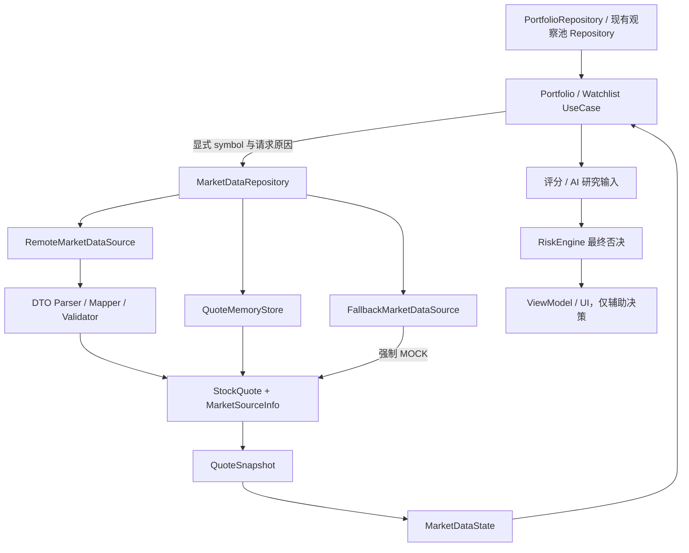

# GD Trade V1.2 行情领域模型契约

## 1. 文档状态

- 契约编号：`market-domain-v1`。
- 版本：1.0。
- 日期：2026-07-14。
- 负责角色：GD Architect Agent。
- 状态：冻结，作为 V1.2 Domain Developer、Remote Data Developer、Repository Developer 和 QA Agent 的共同实现基线。
- 适用范围：股票基础报价、报价请求状态、数据来源、批量快照和行情 Repository 领域端口。
- 不在范围：真实供应商接入、HTTP DTO、Room 持久化、K 线具体模型、板块算法、资金流口径、UI 和任何自动交易能力。

## 2. 设计依据

本契约依据以下资料冻结：

- `docs/ARCHITECTURE.md`。
- `docs/V1_2_MARKET_ARCHITECTURE_PLAN.md`。
- 并行 QA 工作树中的 `.agents/worktrees/qa-market-tests-v1-2/docs/qa/V1_2_MARKET_TEST_PLAN.md`。

QA 测试计划当前位于独立工作树，尚未合并到当前活动分支。本契约只读并逐条对齐该测试基线，不修改 QA Agent 文件。

## 3. 核心决策

1. V1.2 新契约不修改现有 `data/repository/MarketRepository`，旧接口继续作为 Dashboard 兼容边界。
2. 新增的富行情端口命名为 `MarketDataRepository`，建议位于 `domain/repository`。
3. `StockQuote` 表达单只股票的一次报价快照，不承载远程 DTO 或 UI 文案。
4. `MarketDataStatus` 同时用于单只数据质量和请求生命周期，但两者通过 `StockQuote` 与 `MarketDataState` 分层表达。
5. `MarketSourceInfo` 结构化描述来源，`description` 只是展示补充，不能替代状态判断。
6. 批量请求使用 `QuoteSnapshot` 表达覆盖率、缺失代码和逐只状态。
7. 持仓和观察池股票代码由 UseCase 从现有本地 Repository 显式解析，`MarketDataRepository` 不访问 Room，不接收 `Position` 或 `StockCandidate`。
8. K 线、板块和资金流未来使用独立能力接口，不继续扩大 `MarketDataRepository`。
9. Mock、静态样例和 fallback 永远不能标记为实时行情。
10. 行情、评分和 AI 只提供研究辅助，RiskEngine 仍拥有最终且不可反转的否决权。

## 4. 推荐包结构

以下是 Domain Developer 后续实现的目标位置，本任务不创建 Kotlin 文件：

```text
app/src/main/java/com/gudian/gdtrade/domain/
├── model/market/
│   ├── StockQuote.kt
│   ├── MarketDataStatus.kt
│   ├── MarketSourceInfo.kt
│   ├── MarketSourceType.kt
│   ├── MarketDataState.kt
│   ├── MarketDataError.kt
│   ├── QuoteRequest.kt
│   ├── SingleQuoteRequest.kt
│   ├── QuoteSnapshot.kt
│   ├── DataCompleteness.kt
│   ├── FetchPolicy.kt
│   ├── QuoteRequestReason.kt
│   └── RefreshMarketResult.kt
└── repository/
    └── MarketDataRepository.kt
```

## 5. StockQuote 契约

### 5.1 定义

```kotlin
data class StockQuote(
    val symbol: String,
    val name: String,
    val lastPrice: Double?,
    val changePercent: Double?,
    val volume: Long?,
    val turnoverAmount: Double?,
    val turnoverRate: Double?,
    val updatedAt: Instant?,
    val dataStatus: MarketDataStatus,
    val source: MarketSourceInfo
)
```

### 5.2 字段说明

| 字段 | 类型 | 是否可空 | 约束 |
| --- | --- | --- | --- |
| `symbol` | String | 否 | 领域层统一使用六位 A 股或 ETF 代码，不包含 `sh`、`sz` 等供应商前缀 |
| `name` | String | 否 | 股票或 ETF 名称；有有效报价时不得为空，加载或错误且无元数据时由外层状态承载，不创建空名称的伪报价 |
| `lastPrice` | Double | 是 | 人民币元；未知、停牌源未给出或解析失败时为 null，禁止用 0 表示未知 |
| `changePercent` | Double | 是 | 百分比数值，`1.25` 表示上涨 1.25%，不是 0.0125 |
| `volume` | Long | 是 | 股或份；供应商返回“手”时由 Data Mapper 转换，领域层不保留供应商单位 |
| `turnoverAmount` | Double | 是 | 人民币元；万元、亿元等供应商单位必须在 Mapper 中归一化 |
| `turnoverRate` | Double | 是 | 百分比数值，`2.5` 表示 2.5% |
| `updatedAt` | Instant | 是 | 供应商行情时间；供应商未提供时为 null，不得使用手机时间或 `receivedAt` 代替 |
| `dataStatus` | MarketDataStatus | 否 | 该只股票当前数据质量或生命周期状态 |
| `source` | MarketSourceInfo | 否 | 结构化来源、时效能力和延迟信息 |

### 5.3 数值与时间不变量

- `lastPrice` 小于 0 为非法；0 只在供应商明确表示有效市场值时允许，不能作为未知值。
- `volume` 小于 0 为非法。
- `turnoverAmount` 小于 0 为非法。
- `turnoverRate` 和 `changePercent` 可以为负数，但解析失败必须为 null。
- `updatedAt` 必须来自供应商或已验证的本地缓存原始快照。
- Domain 层使用 `java.time.Instant`；显示层转换为 `Asia/Shanghai`。
- 任何 Data Mapper 都不得在字段缺失时用本机当前时间填充 `updatedAt`。

### 5.4 StockQuote 状态不变量

| `dataStatus` | `StockQuote` 中允许的数据 | 约束 |
| --- | --- | --- |
| SUCCESS | 当前有效报价 | 请求与字段校验成功；仍不能仅凭 SUCCESS 宣称实时 |
| LOADING | 上一次可用报价，可选 | 没有旧数据时应由 `MarketDataState(data=null)` 表达，不创建全空 StockQuote |
| ERROR | 上一次可用报价，可选 | 数据只是错误期间的保留快照，不得生成有效交易信号 |
| DELAYED | 延迟或超过新鲜度阈值的报价 | 必须保留真实 `updatedAt` 和来源说明，不得映射为实时 |
| MOCK | 静态、样例、模拟或 fallback 报价 | `source.supportsRealtime=false`，不得生成有效交易信号 |

## 6. MarketDataStatus 契约

### 6.1 定义

```kotlin
enum class MarketDataStatus {
    SUCCESS,
    LOADING,
    ERROR,
    DELAYED,
    MOCK
}
```

V1.2 只允许这五个枚举值。增加、删除或重命名枚举值属于破坏性契约变更，必须由 Architect 和 QA 共同评审。

### 6.2 状态含义

#### SUCCESS

- 远程请求或受信任缓存读取成功。
- 必要字段完成校验。
- 数据满足本次请求的新鲜度要求。
- SUCCESS 不自动等于实时；实时标识还必须满足 `source.supportsRealtime=true`，并且 `updatedAt` 满足新鲜度阈值。

#### LOADING

- 请求正在执行，最终结果尚未确定。
- `MarketDataState.data` 可以携带上一次快照，以减少 UI 无意义闪烁。
- 没有旧数据时 `data=null`。
- LOADING 不得映射为实时或可执行交易信号。

#### ERROR

- 网络、协议、解析、校验或供应商错误导致本次请求失败。
- 可以携带上一次快照，但必须保留错误信息和 ERROR 状态。
- ERROR 不得被 fallback 静默转换成 SUCCESS。
- ERROR 输入不得生成有效交易信号。

#### DELAYED

- 供应商声明行情存在延迟；或
- `updatedAt` 超过请求的新鲜度阈值；或
- 当前供应商的实时能力、授权或时间口径尚未验证。
- DELAYED 数据可以用于观察和研究，但必须明确时效风险，不能显示为实时。

#### MOCK

- 数据来自静态样例、测试 fixture、模拟源或网络失败 fallback。
- MOCK 必须结构化标记，不能只依赖说明文案。
- MOCK 不得映射成 SUCCESS，不得宣称实时，不得生成有效交易信号。

### 6.3 实时判定唯一规则

只有同时满足以下条件，兼容层才可以设置 `isRealtime=true`：

```text
dataStatus == SUCCESS
AND source.supportsRealtime == true
AND updatedAt != null
AND updatedAt 满足当前请求的新鲜度阈值
```

任一条件不满足，均必须为非实时。当前腾讯行情能力和授权时效尚未验证，必须按 `DELAYED` 或更保守状态处理。

## 7. MarketSourceInfo 契约

### 7.1 定义

```kotlin
data class MarketSourceInfo(
    val providerId: String,
    val sourceType: MarketSourceType,
    val supportsRealtime: Boolean,
    val latency: Duration?,
    val description: String,
    val receivedAt: Instant
)

enum class MarketSourceType {
    REMOTE,
    LOCAL_CACHE,
    STATIC_SAMPLE,
    FALLBACK
}
```

### 7.2 字段说明

| 字段 | 类型 | 是否可空 | 语义 |
| --- | --- | --- | --- |
| `providerId` | String | 否 | 稳定、可测试的数据源标识，不使用本地化展示名称作为 ID |
| `sourceType` | MarketSourceType | 否 | 远程、本地缓存、静态样例或 fallback |
| `supportsRealtime` | Boolean | 否 | 该来源是否经过能力、授权和时间口径验证，不能根据请求成功自动设置 |
| `latency` | Duration | 是 | 来源声明或可验证的数据延迟；未知时为 null，不表示网络往返耗时 |
| `description` | String | 否 | 面向用户或日志的中文来源说明，不参与核心状态计算 |
| `receivedAt` | Instant | 否 | App 接收到该批数据的时间，只用于诊断和缓存，不得替代 `StockQuote.updatedAt` |

### 7.3 providerId 约束

V1.2 保留以下稳定测试标识：

- `STATIC_SAMPLE`：静态样例。
- `FALLBACK`：网络失败或缺失数据的 fallback。

真实或延迟供应商使用 Architect 批准的稳定 ID。providerId 不包含请求时间、股票代码或随机数。

### 7.4 sourceType 约束

| sourceType | supportsRealtime | 允许的主要状态 |
| --- | --- | --- |
| REMOTE | true 或 false | SUCCESS、LOADING、ERROR、DELAYED |
| LOCAL_CACHE | false | SUCCESS、LOADING、ERROR、DELAYED；缓存只有满足 maxAge 时才可为 SUCCESS |
| STATIC_SAMPLE | 必须 false | MOCK |
| FALLBACK | 必须 false | MOCK 或 ERROR，不能 SUCCESS |

### 7.5 latency 语义

- `latency` 表示行情内容相对市场事件的声明或已验证延迟，不表示 HTTP 请求耗时。
- 未知延迟必须为 null，禁止填 0 伪装无延迟。
- `supportsRealtime=false` 且 `latency=null` 表示时效能力未知，状态至少为 DELAYED。
- 网络耗时若未来需要，应建立独立诊断字段，不复用本字段。

## 8. 请求与批量快照契约

### 8.1 FetchPolicy

```kotlin
enum class FetchPolicy {
    CACHE_FIRST,
    NETWORK_FIRST,
    NETWORK_ONLY
}
```

- `CACHE_FIRST`：缓存满足 `maxAge` 时可直接使用，否则请求远程。
- `NETWORK_FIRST`：优先远程，失败时可以保留缓存或进入明确 fallback。
- `NETWORK_ONLY`：最终结果不使用缓存或 Mock 冒充成功；可以在 LOADING 期间展示旧数据，但最终状态必须反映远程结果。

### 8.2 QuoteRequestReason

```kotlin
enum class QuoteRequestReason {
    BATCH,
    PORTFOLIO,
    WATCHLIST,
    STOCK_DETAIL,
    MARKET_OVERVIEW,
    AI_CONTEXT,
    SCORING
}
```

该字段用于日志、策略和测试，不改变同一 symbol 的市场事实。

### 8.3 SingleQuoteRequest

```kotlin
data class SingleQuoteRequest(
    val symbol: String,
    val policy: FetchPolicy,
    val maxAge: Duration,
    val reason: QuoteRequestReason = QuoteRequestReason.STOCK_DETAIL
)
```

约束：

- `symbol` 必须是标准六位代码。
- `maxAge` 必须大于等于零。
- 单股票详情使用 `STOCK_DETAIL`；其他原因允许复用，但必须明确。

### 8.4 QuoteRequest

```kotlin
data class QuoteRequest(
    val symbols: Set<String>,
    val policy: FetchPolicy,
    val maxAge: Duration,
    val reason: QuoteRequestReason
)
```

约束：

- `symbols` 必须显式、去重、标准化。
- Repository 不接受空集合。空持仓或空观察池由 UseCase 直接输出空状态，不发起 Repository 请求。
- `maxAge` 必须大于等于零。
- Repository 可以内部按供应商批量上限分片，但输出必须恢复完整 symbol 对照。
- Set 不表达 UI 顺序；持仓和观察池顺序由 UseCase 使用原始列表恢复。

### 8.5 DataCompleteness

```kotlin
enum class DataCompleteness {
    COMPLETE,
    PARTIAL,
    EMPTY
}
```

- COMPLETE：每个 requested symbol 都有一条结果，包括明确的 Mock fallback；完整度只表示覆盖率，不表示质量。
- PARTIAL：至少一条可用结果，但仍存在 missing symbol。
- EMPTY：没有任何股票结果。

### 8.6 QuoteSnapshot

```kotlin
data class QuoteSnapshot(
    val requestedSymbols: Set<String>,
    val quotes: Map<String, StockQuote>,
    val missingSymbols: Set<String>,
    val completeness: DataCompleteness,
    val generatedAt: Instant
)
```

不变量：

```text
quotes.keys 是 requestedSymbols 的子集
missingSymbols == requestedSymbols - quotes.keys
quotes.keys 与 missingSymbols 不相交
```

- `generatedAt` 是 Repository 完成快照组合的时间，不是行情更新时间。
- 每条 `StockQuote.updatedAt` 保留供应商时间。
- 远程与 Mock 混合时，每条报价保持自身 `dataStatus` 和 `source`。
- 批次状态不能把含 Mock 的快照伪装为全部远程成功。

## 9. 请求生命周期契约

### 9.1 MarketDataError

```kotlin
data class MarketDataError(
    val code: String,
    val message: String,
    val retryable: Boolean,
    val affectedSymbols: Set<String>,
    val providerId: String?
)
```

约束：

- 错误必须保留受影响 symbol。
- `message` 使用可诊断中文，不包含账户密码、Cookie、验证码或敏感响应内容。
- 供应商未知时 providerId 为 null。
- DataSource 异常不得直接泄露到 UI；Repository 映射为该领域错误。

### 9.2 MarketDataState

```kotlin
data class MarketDataState<T>(
    val status: MarketDataStatus,
    val data: T?,
    val error: MarketDataError? = null
)
```

不变量：

- `status=ERROR` 时 `error` 必须非空。
- 非 ERROR 状态通常 `error=null`；部分失败的批量结果允许携带错误，但总体状态必须按汇总规则处理。
- `status=LOADING` 可以携带上一次数据。
- `data=null` 不等于空批次；空批次应由 UseCase 明确输出，不调用 Repository。
- UI 和 UseCase 不得丢弃 status 或 error，只保留 data。

### 9.3 批次状态汇总

按以下顺序决定 `MarketDataState<QuoteSnapshot>.status`：

1. 请求执行中：LOADING。
2. 没有可用结果且请求失败：ERROR。
3. 任一结果为 MOCK：MOCK。
4. 没有 Mock，但任一结果为 DELAYED：DELAYED。
5. 全部结果满足 SUCCESS：SUCCESS。

部分缺失但仍有成功结果时：

- `completeness=PARTIAL`。
- `missingSymbols` 必须准确。
- 可以携带 `MarketDataError` 描述缺失原因。
- 不能仅根据列表非空标记为完整 SUCCESS。

### 9.4 RefreshMarketResult

```kotlin
data class RefreshMarketResult(
    val requestedSymbols: Set<String>,
    val refreshedSymbols: Set<String>,
    val failedSymbols: Set<String>,
    val status: MarketDataStatus,
    val error: MarketDataError? = null
)
```

约束：

- `refreshedSymbols` 与 `failedSymbols` 不相交。
- 两者均为 `requestedSymbols` 子集。
- refresh 返回结果用于事件反馈；持续状态仍由 observe 方法提供。
- refresh 失败不得清空上一次有效快照。

## 10. MarketDataRepository 冻结接口

### 10.1 定义

```kotlin
interface MarketDataRepository {
    fun observeQuote(
        request: SingleQuoteRequest
    ): Flow<MarketDataState<StockQuote>>

    fun observeQuotes(
        request: QuoteRequest
    ): Flow<MarketDataState<QuoteSnapshot>>

    suspend fun refreshQuotes(
        request: QuoteRequest
    ): RefreshMarketResult
}
```

### 10.2 接口语义

#### observeQuote

- 支持单股票查询和股票详情页当前报价。
- 首次订阅可以先发出 LOADING，再发出最终状态。
- 不返回远程 DTO。
- 不读取 Position、StockCandidate 或 Room。

#### observeQuotes

- 支持显式批量股票查询。
- 持仓和观察池通过 UseCase 传入明确 symbol 集合。
- 返回结构化 QuoteSnapshot，而不是无状态列表。
- 支持部分成功、缺失、延迟、Mock 和错误状态。

#### refreshQuotes

- 主动触发请求，不改变 observe 契约。
- Repository 负责去重、分片、取消过时请求和共享快照。
- 新旧兼容接口由同一 Repository 实现或 Adapter 共享结果，禁止重复发起网络请求。

### 10.3 当前持仓行情

`MarketDataRepository` 不新增 `observePortfolio()` 方法。标准数据流：

```text
PortfolioRepository.observePositions()
    -> GetPortfolioQuotesUseCase 提取并去重 symbol
        -> QuoteRequest(reason=PORTFOLIO)
            -> MarketDataRepository.observeQuotes()
```

空持仓时 UseCase 直接输出空 `PortfolioQuoteSnapshot`，不得以空 symbol 请求 Repository。

### 10.4 观察池行情

`MarketDataRepository` 不新增 `observeWatchlist()` 方法。标准数据流：

```text
现有 MarketRepository.observeCandidates()
    -> GetWatchlistQuotesUseCase 提取并去重 symbol
        -> QuoteRequest(reason=WATCHLIST)
            -> MarketDataRepository.observeQuotes()
```

UseCase 按原观察池顺序组合输出，Repository 不负责 UI 排序。

### 10.5 单股票详情

```text
GetStockDetailUseCase
    -> SingleQuoteRequest(reason=STOCK_DETAIL)
        -> MarketDataRepository.observeQuote()
```

本契约只提供当前报价。公司资料、K 线或资金流由未来独立能力接口组合。

## 11. 未来能力边界

K 线、板块和资金流不加入本次 `MarketDataRepository`，后续分别设计：

```kotlin
interface CandleRepository
interface SectorMarketRepository
interface CapitalFlowRepository
```

理由：

- 三类数据的时间粒度、缓存、分页、来源和质量规则不同。
- 提前加入未定义方法会冻结错误抽象。
- Domain Developer 本阶段不得创建占位返回 Mock 的未来能力实现。
- 没有可验证数据源时，板块和资金流功能应保持不可用，而不是用样例生成真实研究结论。

未来接口必须复用以下基础概念：

- MarketDataStatus。
- MarketSourceInfo。
- MarketDataState。
- 明确更新时间、来源和完整度。

## 12. 数据流



### 12.1 远程成功

```text
Remote 响应
  -> Parser 解析
  -> Mapper 单位归一化与字段校验
  -> StockQuote(SUCCESS 或 DELAYED)
  -> QuoteSnapshot
  -> MarketDataState
```

### 12.2 远程部分缺失

```text
成功 symbol -> 保留远程状态和来源
缺失 symbol -> 只对缺失部分调用 fallback
fallback -> StockQuote(MOCK)
批次 -> completeness=COMPLETE 或 PARTIAL，整体状态=MOCK
```

### 12.3 远程全部失败

```text
有明确 fallback -> MarketDataState(MOCK)
无可用 fallback -> MarketDataState(ERROR, data=null, error=...)
```

不得把 fallback 结果标记为 SUCCESS。

## 13. 与 QA 契约对应关系

| QA 基线要求 | 本领域契约 | Domain Developer/QA 断言 |
| --- | --- | --- |
| StockQuote 字段完整性 | 第 5 节 StockQuote | 所有字段类型、空值和单位与契约一致 |
| 固定 Instant | `updatedAt`、`receivedAt`、`generatedAt` | 测试使用固定时间，不依赖系统时钟 |
| 未知值不用 0 或空字符串 | 字段可空与数值不变量 | 未知价格、成交量、成交额、换手率为 null |
| SUCCESS 不等于实时 | 第 6.3 节实时唯一规则 | 仅 SUCCESS + supportsRealtime + 新鲜时间可实时 |
| 五种状态边界 | MarketDataStatus | 枚举精确包含 SUCCESS/LOADING/ERROR/DELAYED/MOCK |
| 静态来源稳定 ID | MarketSourceInfo | `providerId=STATIC_SAMPLE`、`sourceType=STATIC_SAMPLE` |
| Mock 不得实时 | 状态与来源不变量 | MOCK、STATIC_SAMPLE、FALLBACK 的 supportsRealtime=false |
| 当前未验证远程源保守处理 | DELAYED 定义 | 当前源预期 DELAYED 或更保守状态 |
| 供应商时间缺失 | StockQuote.updatedAt | 保持 null，不用 receivedAt 或手机时间替代 |
| Repository 远程成功不调用 fallback | Repository 语义 | Fake fallback 调用次数为 0 |
| 全部失败不得伪 SUCCESS | 状态汇总 | 输出 ERROR 或明确 MOCK |
| 部分缺失只回退缺失 symbol | QuoteSnapshot | 成功数据保留，missingSymbols 与 fallback 请求一致 |
| 每只股票保留状态和来源 | StockQuote + Map | 不只断言列表长度，逐只断言 status/source |
| 空持仓/观察池不请求网络 | QuoteRequest 非空约束 | UseCase 直接输出空状态，Fake Repository 调用次数为 0 |
| 状态在 UseCase 不丢失 | MarketDataState | LOADING/ERROR/DELAYED/MOCK 原样传递 |
| ERROR/MOCK 不生成有效交易信号 | 安全边界 | 评分或 AI 输出不可绕过状态校验 |
| RiskEngine 否决优先 | 数据流与安全规则 | 研究信号不能覆盖 RiskEngine deny |

## 14. QA 契约模板接入要求

Domain Developer 完成 Kotlin 模型后：

1. 在 Domain 测试包中接入 QA 工作树提供的契约模板。
2. 使用薄适配器映射生产模型，不得在测试适配器重新实现状态规则。
3. 保留 QA fixture 自检，确保 UTF-8、固定时间和 Mock 安全不变量持续通过。
4. 对所有枚举使用穷举断言，防止未评审状态进入系统。
5. 对实时标识、Mock 和 DELAYED 建立负向测试。
6. 合并 QA 分支前处理同名测试文件冲突，不覆盖任一 Agent 的未合并改动。

当前 QA 计划位于独立工作树，Domain Developer 可以按本契约开始实现，但在阶段验收前必须将 QA 基线或等价契约测试合并到目标分支。

## 15. Developer 实现边界

### 15.1 Domain Developer 允许修改

- `domain/model/market/**`。
- `domain/repository/MarketDataRepository.kt`。
- 对应 `app/src/test/**/domain/market/**` 契约测试。
- 经 Architect 协调后的 `docs/ARCHITECTURE.md`、`CHANGELOG.md` 和 `TASK_COMPLETION.md`。

### 15.2 Domain Developer 禁止修改

- 现有 `data/repository/MarketRepository.kt`。
- 现有 `domain/model/MarketQuote.kt`。
- `RoomTradeRepository` 和 LocalDataSource。
- Room Entity、DAO、Database、Schema 和 Migration。
- RemoteMarketDataSource、HTTP 客户端和真实 API。
- DashboardViewModel、Compose UI。
- RiskEngine 和交易逻辑。

### 15.3 Remote Data Developer 边界

- Remote 层可以定义 DTO、Parser、Mapper 和分类错误。
- Remote DTO 不得实现或替代 StockQuote。
- Mapper 必须按本契约输出单位、时间、状态和来源。
- Remote 层不得决定持仓、观察池、评分或 RiskEngine 结果。
- 当前未验证供应商必须输出 DELAYED 或错误，不得声明真实实时。

### 15.4 Repository Developer 边界

- 实现 MarketDataRepository 的组合、缓存、fallback、批次状态和刷新语义。
- 不修改冻结接口，发现缺口先提交 Architect 评审。
- 不把空 symbol 解释为持仓。
- 不将远程异常直接抛给 ViewModel。
- 不让旧接口与新接口重复请求同一行情。

### 15.5 UseCase Developer 边界

- 持仓和观察池 UseCase 负责提取、去重和保留显示顺序。
- 空集合不调用 MarketDataRepository。
- 业务输出必须保留 MarketDataState、missingSymbols 和来源。
- 评分与 AI 输入必须拒绝或降低 Mock、ERROR、严重 DELAYED 数据的置信度。
- RiskEngine 否决不可被覆盖。

## 16. 兼容策略

### 16.1 现有接口

以下现有类型继续冻结，本任务不修改：

- `data/repository/MarketRepository`。
- `domain/model/MarketQuote`。
- `PortfolioRepository`。
- DashboardUiState。

### 16.2 单向 Adapter

Repository Developer 后续建立：

```text
StockQuote -> MarketQuote
```

映射规则：

- `lastPrice`、`changePercent` 直接映射。
- `sourceLabel` 从 MarketSourceInfo、updatedAt 和 dataStatus 统一格式化。
- `isRealtime` 严格使用第 6.3 节唯一规则。
- DELAYED、MOCK、ERROR、LOADING 一律映射为 false。

禁止从旧 MarketQuote 反推完整 StockQuote，因为旧模型缺少成交量、成交额、换手率、更新时间和结构化来源。

## 17. 契约变更规则

本文件状态为冻结。以下修改属于破坏性变更：

- 删除、重命名或改变字段类型。
- 改变数值单位或百分比口径。
- 增删 MarketDataStatus 枚举值。
- 放宽 Mock、Delayed 或实时判定规则。
- 让 MarketDataRepository 读取 Room、Position 或 StockCandidate。
- 将 K 线、板块或资金流直接加入本接口。

破坏性变更必须：

1. 由 GD Architect Agent 说明原因和兼容方案。
2. 更新本契约、`docs/ARCHITECTURE.md` 和 `CHANGELOG.md`。
3. 与 GD QA Agent 同步更新契约测试。
4. 在 `TASK_COMPLETION.md` 说明迁移影响。
5. 通过现有 V1.1 与 V1.2 回归门禁。

## 18. Domain Developer 进入条件

当前结论：**可以进入 Domain Developer 阶段。**

进入条件：

1. 严格按本文件 1.0 契约创建 Kotlin 模型和新 `MarketDataRepository`，不修改旧接口。
2. 在独立分支声明 `domain/model/market/**` 与 `domain/repository/MarketDataRepository.kt` 所有权。
3. 接入或等价实现并行 QA 工作树的契约测试。
4. 不实现网络、Room、UI、评分算法或交易能力。
5. 完成后运行单元测试、Debug 构建和 `git diff --check`。
